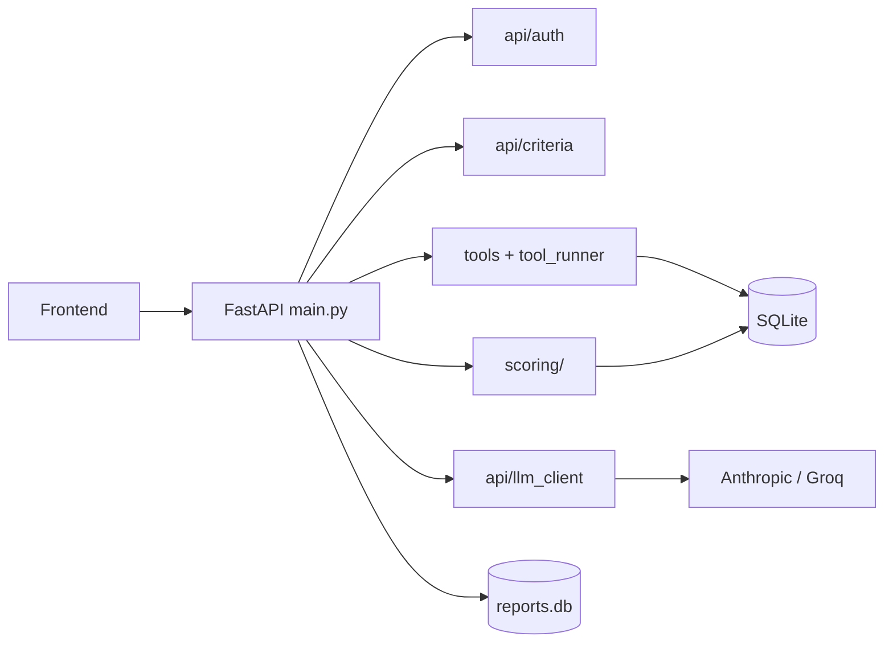

# AI Staffing Copilot

Internal staffing assistant for engineering managers. Given a natural-language request (“Need a Python engineer in Berlin by August, German B2+ for client work”), it searches a bench database, scores candidates with transparent rules, surfaces judgment flags, and produces an auditable approval record — with LLM used only for text extraction and summaries, not for ranking.

## What problem this solves

Enterprise staffing tools are good at checkbox matching. They are weak at the things managers actually argue about:

- **Partial skill fit** — someone strong on Python but missing LangGraph should still appear, ranked below a full match, not disappear from the pool.
- **Weighted trade-offs** — availability vs. depth vs. German client-facing fluency changes per request; a fixed filter cannot express “I care more about German this time.”
- **Operational judgment** — bench duration, prior rejections for the same client, and thin project history matter as much as skill overlap; those signals rarely surface in SAP-style search.
- **German compliance context** — Betriebsrat notification, GDPR erasure, and LLM data minimization are first-class concerns, not afterthoughts.
- **Institutional memory** — past rejections should inform the next search without silently blacklisting people.

This project implements those behaviors in a small, inspectable Python stack you can run locally or in Docker.

## How it works

**Criteria extraction** — The manager’s message (plus optional structured form fields) is parsed into `ScoreCriteria`: required skills, location, deadline, per-skill weights, German fluency requirement, and scoring weight profile. An LLM assists when the message is ambiguous; structured UI input can bypass it.

**Deterministic search and ranking** — SQLite queries fetch a skill-expanded candidate pool. `scoring/` applies weighted skill matching (including adjacent skills), availability, German fluency, and configurable dimension weights. A judgment layer adds flags (long bench, sparse history, prior rejection memory). **Ranking never goes through the LLM.**

**LLM narratives** — After ranking, names are stripped to `candidate#ID` before any provider call. The LLM writes the search summary and approval justification; labels are resolved back server-side. Every call is audit-logged with redacted payloads.

**Manager workflow** — Streamed NDJSON drives the UI timeline. The manager reviews ranked cards, opens full profiles, approves or rejects, and downloads a PDF report. Rejections feed `reports.db` for future memory hints.

## Architecture



Detailed setup and sequence diagrams: [docs/ARCHITECTURE.md](docs/ARCHITECTURE.md).  
Data processing and GDPR notes: [docs/DATA_PROCESSING.md](docs/DATA_PROCESSING.md).

## Evaluation

**Automated tests (65)** — Unit and API tests cover skill matching, scoring weights, German fluency, judgment flags, staffing memory, encryption, GDPR erasure, tool permissions, and mocked agent-search streaming. Run:

```bash
PYTHONPATH=src python -m unittest discover -s tests -q
```

**Offline eval harness (`eval/`)** — A separate framework scores synthetic runs on task success, tool accuracy, planning, grounding, hallucination rate, safety, latency, ranking NDCG/MRR, and permission enforcement. It uses recorded JSON runs, not live production traffic. Useful for regression tracking; **not** a substitute for validation on your real HR data.

```bash
pip install pandas
python eval/run_all.py
```

Honest limitation: eval scenarios are authored against the demo Bosch-style dataset, not a live enterprise HRIS. Ranking quality on your data will differ.

## Cost comparison

Rough order-of-magnitude for **one manager search** (criteria extraction + ranked summary, ~3–6k input tokens and ~400–800 output tokens on a mid-size candidate list):

| Provider | Typical cost per search | Notes |
|----------|----------------------|--------|
| **Claude Sonnet** (Anthropic) | ~$0.01–0.03 | At published ~$3/M input, ~$15/M output (Sonnet-class; verify current pricing) |
| **Groq** (Llama / open models) | ~$0.001–0.005 | Often an order of magnitude cheaper; varies by model |
| **This stack (self-hosted)** | LLM spend only + your infra | SQLite, no per-seat SaaS fee |

Enterprise staffing suites (**SAP SuccessFactors**, **SAP Fieldglass**, **Workday**, etc.) typically price per employee or contingent worker under management, often **tens of dollars per seat/month** plus implementation and integration — **six-figure projects are common** for global rollouts. Public list prices are rarely published; these are industry ranges, not quotes.

This project is not a replacement for a global HRIS. It is a **decision-support layer** you can run for pennies per search if you already have employee data accessible.

## What makes this different

| Typical staffing tool | This project |
|----------------------|--------------|
| Binary skill filters | Partial match + adjacent skills, ranked |
| Fixed scoring | Per-search weight profiles (skills vs. availability vs. German) |
| Black-box ranking | Explainable score breakdown per candidate |
| No rejection memory | Read-only staffing memory from past reports |
| LLM does everything | LLM only for text; SQL + rules do ranking |
| PII sent to models | Minimized prompts + audit log + GDPR delete endpoint |

## Quick start (Docker)

```bash
git clone <repo-url> staffing-copilot && cd staffing-copilot
cp .env.example .env
# Edit .env: set JWT_SECRET and MASTER_KEY (openssl rand -hex 32 for each)

cd docker
docker compose up --build
```

- **UI:** http://localhost:8080 (nginx proxies API routes to the backend)
- **API direct:** http://localhost:8000

First boot seeds demo employee data into a Docker volume. Create a manager login:

```bash
docker compose exec api python dev-scripts/create_user.py manager yourpassword
```

LLM API keys are configured per manager in the Settings UI (encrypted with `MASTER_KEY`), not baked into the image.

## Local development (without Docker)

```bash
python -m venv .venv
source .venv/bin/activate   # Windows: .\.venv\Scripts\activate
pip install -r requirements.txt
cp .env.example .env        # set JWT_SECRET, MASTER_KEY

pip install faker
PYTHONPATH=src python dev-scripts/seed_employees.py
PYTHONPATH=src python dev-scripts/create_user.py manager yourpassword

# Terminal 1 — API
PYTHONPATH=src uvicorn main:app --reload --port 8000 --app-dir src

# Terminal 2 — frontend
cd frontend && python -m http.server 5500
```

Open http://localhost:5500

## Environment variables

| Variable | Required | Purpose |
|----------|----------|---------|
| `JWT_SECRET` | Yes | Signs manager session tokens |
| `MASTER_KEY` | Yes | 64 hex chars; encrypts stored LLM API keys |
| `STAFFING_DATA_DIR` | No | Directory for `*.db` files (default: repo root; Docker uses `/data`) |
| `CORS_ORIGINS` | No | Comma-separated browser origins |
| `ANTHROPIC_ZDR_CONFIRMED` | No | Admin flag after Anthropic ZDR arrangement |
| `GROQ_ZDR_CONFIRMED` | No | Admin flag after Groq Data Controls enabled |

See [.env.example](.env.example) for the full list.

## Known limitations

- **SQLite** — fine for demos and single-node pilots; not HA or multi-tenant production storage.
- **Demo data** — `seed_employees.py` generates fictional German OEM-style records, not your real org chart.
- **No HRIS integration** — no SuccessFactors/Workday connector; you would ETL into the schema or replace `tools/`.
- **Manager-only auth** — simple JWT + bcrypt; no SSO, RBAC beyond manager vs. read-only tool roles.
- **LLM provider lock-in surface** — Anthropic and Groq supported; switching models requires config, not plug-and-play enterprise MLOps.
- **Evaluation scope** — offline metrics on synthetic runs; no continuous production monitoring shipped.
- **ZDR is manual** — env flags record admin confirmation; the app cannot verify provider retention policies.

## Repository map

| Path | Purpose |
|------|---------|
| `src/main.py` | FastAPI entrypoint, agent-search stream, approve/reject |
| `src/api/` | Auth, LLM client, criteria extraction, GDPR, PDF, settings |
| `src/data/` | SQLite access, audit log, credentials, staffing memory |
| `src/scoring/` | Skill matching, weights, German fluency, judgment flags |
| `src/tools/` | SQL-backed search, availability, project history tools |
| `src/tool_runner.py` | Role-aware tool dispatcher |
| `frontend/` | Static manager UI (HTML/CSS/JS) |
| `tests/` | 65 automated tests |
| `eval/` | Offline agent evaluation harness |
| `dev-scripts/` | Seed data, create user, sample scoring demos, dev agent loop |
| `docker/` | Dockerfile, compose, nginx proxy config |
| `docs/` | Architecture and data-processing documentation |

## License

MIT — see [LICENSE](LICENSE).
