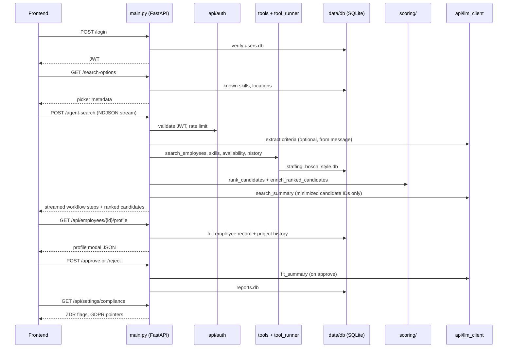

# Architecture — AI Staffing Copilot

## First-time setup

After cloning the repository:

1. **Python environment**
   ```powershell
   python -m venv .venv
   .\.venv\Scripts\pip install -r requirements.txt
   ```

2. **Environment variables** — copy `.env.example` to `.env` and set `JWT_SECRET` and `MASTER_KEY` (e.g. `openssl rand -hex 32` for each).

3. **Seed employee data** — the app reads from `staffing_bosch_style.db` (under `STAFFING_DATA_DIR` if set, otherwise the project root). Until you seed it, searches return no candidates.
   ```powershell
   .\.venv\Scripts\pip install faker
   .\.venv\Scripts\python.exe dev-scripts/seed_employees.py
   ```

4. **Create a manager account**
   ```powershell
   .\.venv\Scripts\python.exe dev-scripts/create_user.py --username manager --password yourpassword
   ```

5. **Run the API** (from project root; `src` must be on `PYTHONPATH`):
   ```powershell
   $env:PYTHONPATH="src"
   .\.venv\Scripts\python.exe -m uvicorn main:app --reload --port 8000 --app-dir src
   ```

6. **Run the frontend** (separate terminal):
   ```powershell
   cd frontend
   python -m http.server 5500
   ```

Open `http://localhost:5500`, log in, and run a staffing search.

## Repository layout

```
src/
  api/          HTTP layer: auth, criteria extraction, LLM client, GDPR, PDF reports, settings
  data/         SQLite access, staffing memory, audit log, manager credentials
  scoring/      Candidate ranking: skill matching, weights, German fluency, judgment flags
  tools/        SQL-backed tool implementations (search, availability, project history)
  main.py       FastAPI app entrypoint
  tool_runner.py  Role-aware dispatcher for agent tools
frontend/       Static HTML/CSS/JS UI
tests/          Unit and API integration tests
eval/           Offline evaluation harness
dev-scripts/    Seed data, user creation, sample scoring demos
docs/           Architecture and data-processing documentation
```

## Request flow



### Agent search (production path)

`POST /agent-search` is handled entirely in `src/main.py` via `run_agent_search_streaming()`. It does **not** use the dev-only Claude loop in `dev-scripts/agent_loop.py`.

High-level steps:

1. **Authenticate** — JWT from `Authorization: Bearer …`; manager role required.
2. **Extract criteria** — merge structured `search_config` from the UI with LLM-parsed fields from the manager's message (`api/criteria.py`).
3. **Fetch pool** — `tools.tools.fetch_candidates_for_ranking()` queries SQLite with skill expansion and location filters.
4. **Score & rank** — `scoring/scorer.py` applies weighted skill matching, German fluency, availability, and judgment-layer flags (`scoring/judgment.py`).
5. **LLM narrative** — `api/llm_data_minimization.py` strips names before the summary prompt; labels are restored in the response.
6. **Stream** — newline-delimited JSON events (`workflow_step`, `ranked_candidates`, `search_summary`, etc.) for the frontend progress UI.

### Data stores

| File | Purpose |
|------|---------|
| `staffing_bosch_style.db` | Employees, skills, projects, allocations (seeded) |
| `users.db` | Manager accounts and encrypted LLM API keys |
| `reports.db` | Staffing reports, rejections, LLM audit log, GDPR erasure log |

Paths are resolved from `data/db.py` relative to the project root.

### Security & compliance hooks

- **Auth** — bcrypt passwords, HS256 JWT (`api/auth.py`).
- **Tool permissions** — `tool_runner.py` enforces read-only vs manager roles.
- **LLM audit** — every provider call logged with redacted payloads (`data/llm_audit.py`).
- **GDPR erasure** — `DELETE /api/candidates/{id}/gdpr-delete` (`api/gdpr.py`).
- **ZDR checklist** — `ANTHROPIC_ZDR_CONFIRMED` / `GROQ_ZDR_CONFIRMED` in `.env`; surfaced in Settings.

See [DATA_PROCESSING.md](./DATA_PROCESSING.md) for field-level PII mapping and provider obligations.
